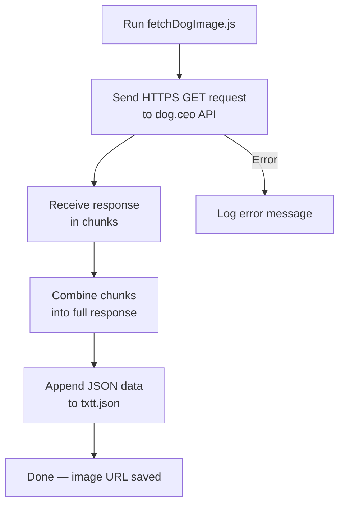

# Dog Image API Fetcher

A Node.js script that fetches random dog images from a public API and saves the results to a local JSON file.

Built as part of learning JavaScript, REST APIs, and file handling in Node.js.

---

## What it does

- Calls the [Dog CEO API](https://dog.ceo/dog-api/) to get a random dog image URL
- Appends the response to a local JSON file (`txtt.json`)
- Handles errors gracefully

## How it works



## Sample Output

```json
{"message":"https://images.dog.ceo/breeds/hound-english/n02089973_243.jpg","status":"success"}
{"message":"https://images.dog.ceo/breeds/spaniel-welsh/n02102177_1798.jpg","status":"success"}
```

## How to Run

### Prerequisites
- Node.js installed ([Download here](https://nodejs.org/))

### Steps

```bash
# 1. Clone the repository
git clone https://github.com/YOUR_USERNAME/dog-image-api-fetcher.git
cd dog-image-api-fetcher

# 2. Run the script
node fetchDogImage.js

# 3. Check the output
cat txtt.json
```

Each run appends a new dog image URL to `txtt.json`.

## Concepts Covered

- HTTPS requests in Node.js using the built-in `https` module
- Handling streamed response data with chunks
- File I/O using the `fs` module (`appendFile`)
- Working with a public REST API
- Basic error handling

## Future Improvements

- [ ] Fetch multiple images in one run
- [ ] Display the image directly in the browser
- [ ] Filter images by dog breed
- [ ] Store results in a database instead of a flat file

---

*Developed while learning JavaScript and Node.js*
